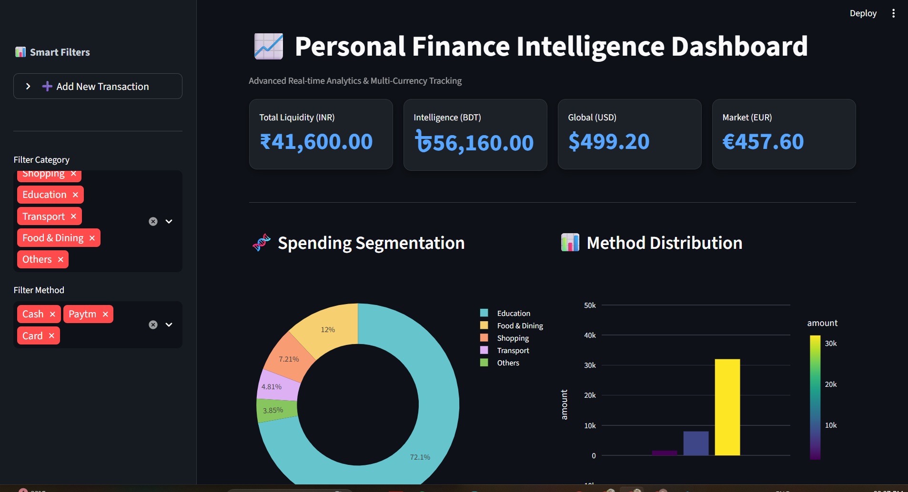
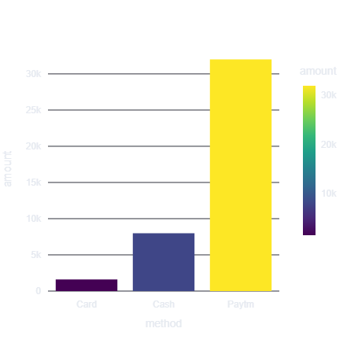
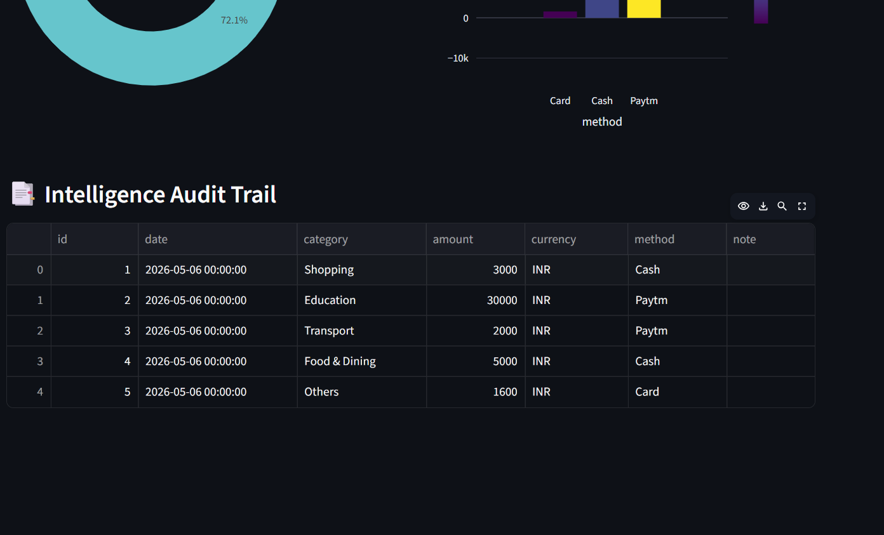

                   💸 Personal Expense Intelligence Dashboard

Advanced Financial Analytics & Multi-Currency Tracking System🌟 Project OverviewThis is a professional-grade Personal Finance Intelligence Dashboard built to solve the problem of fragmented expense tracking. Unlike simple spreadsheets, this system provides a centralized "Intelligence Audit Trail," enabling users to monitor liquidity across multiple global currencies (INR, BDT, USD, EUR) in real-time.Why this matters for HR/Recruiters:Data Engineering: Implements a robust ETL (Extract, Transform, Load) pipeline.Full-Stack Thinking: Integrates a Python backend with a reactive, custom-styled frontend.Business Value: Focuses on actionable insights and data-driven decision-making.

🖼️ ## 📊 Dashboard Preview

### Main Dashboard

### Spending Analysis

### Expense Data Table

🚀 Key FeaturesSmart Intelligence Entry:
 A reactive sidebar for real-time transaction syncing and auto-saving.Multi-Currency Liquidity View: Automatic conversion logic for global financial oversight (INR, BDT, USD, EUR).Advanced Data Visualization:Spending Segmentation: Interactive donut charts for category-wise analysis.Trend Intelligence: Time-series analysis to track daily and monthly spending habits.Automated Reporting:Auto-generates Master Excel Logs in the /reports folder.Auto-exports Category Summaries to CSV.Relational Persistence: Powered by SQLite for secure, reliable, and persistent local data storage.🛠️ Tech StackLanguage: Python 3.14+Frontend/UI: Streamlit (Custom CSS injected for Dark Mode and UI optimization)Analytics: Pandas, NumPyVisualization: Plotly Express (High-impact interactive charts)Database: SQLite3 / SQLAlchemyReporting: OpenPyXL (Excel Automation)📂 Professional ArchitecturePlaintextPersonal-Expense-Tracker/
│
├── database/           # Persistent SQLite storage (.db)
├── reports/            # Auto-generated Business Intelligence reports (Excel/CSV)
├── images/             # Documentation assets and high-res screenshots
├── src/                
│   ├── database.py     # Data Engineering & CRUD logic
│   └── dashboard.py    # UI/UX & Visualization engine
├── requirements.txt    # Dependency management
├── .gitignore          # Environment security (ignores DB and Cache)
└── README.md           # Professional documentation
⚙️ Installation & ExecutionClone the Repository:
Bashgit clone 
[https://github.com/dalimkumar452_sudo/Personal-Expense-Tracker.git]
cd Personal-Expense-Tracker

Install Dependencies:Bashpip install pandas streamlit plotly sqlalchemy openpyxl

Launch the Intelligence Dashboard:Bashpython -m streamlit run src/dashboard.py

🎓 Learning Outcomes 
Architected a modular Python application separating UI logic from Database persistence.Mastered Custom CSS Injection in Streamlit to create a bespoke, professional user experience.Implemented automated data-handling routines to reduce manual reporting time by 100%.

Developed by: DALIM KUMAR
Goal: Building Scalable Financial Intelligence Tools.